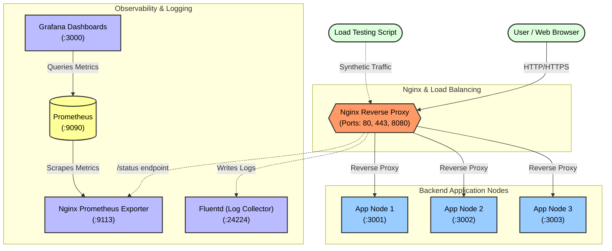

# Nginx Load Balancer & Monitoring Stack

This project is a comprehensive setup demonstrating Nginx as a reverse proxy and load balancer, alongside a robust monitoring and log aggregation stack using Prometheus, Grafana, and Fluentd. 


## 🚀 Features

* **Reverse Proxy & Load Balancing:** Nginx distributes incoming traffic across three Node.js backend instances (`app1`, `app2`, `app3`).
* **HTTPS/SSL Support:** Pre-configured to support secure connections with self-signed certificates or Let's Encrypt (Certbot).
* **Static File Serving:** Nginx serves static HTML content from the `html` directory.
* **Monitoring Stack:** Integrated with Prometheus for metrics collection and Grafana for powerful visualization dashboards.
* **Log Aggregation:** Fluentd is used to collect and aggregate Nginx access and error logs.
* **Containerized Environment:** Fully managed by Docker Compose for easy setup and teardown.

## 🏗️ Architecture

The architecture consists of the following Docker containers:

* **nginx:** The core reverse proxy and load balancer.
* **app1, app2, app3:** Node.js backend services serving API endpoints (`/api`, `/api/health`).
* **nginx-prometheus-exporter:** Extracts metrics from Nginx's stub status and exposes them for Prometheus.
* **prometheus:** Time-series database that scrapes metrics from the exporter.
* **grafana:** Analytics and interactive visualization web application.
* **fluentd:** Data collector for unified logging layer.

Here is a visual representation of the Nginx project, including the load testing script, the application nodes, and the entire observability stack (Prometheus, Grafana, and Fluentd).



## 📋 Prerequisites

* Docker and Docker Compose installed on your system.
* OpenSSL (for generating self-signed certificates).

## 🛠️ Setup & Installation

### 1. Generate SSL Certificates
Before starting the services, generate a self-signed certificate for Nginx (or provide your own).

```bash
mkdir -p certs
openssl req -x509 -nodes -days 365 \
  -newkey rsa:2048 \
  -keyout certs/selfsigned.key \
  -out certs/selfsigned.crt \
  -subj "/C=US/ST=State/L=City/O=Organization/CN=localhost" \
  -sha256
```

*(Note: The `nginx.conf` is configured to look for these certificates in `/etc/nginx/certs/`)*


### 2. Start the Stack
Bring up all the services using Docker Compose:

```bash
docker compose up --build -d
```

## 🌐 Endpoints & Services

Once the stack is running, you can access the following services:

| Service | URL | Description |
|---|---|---|
| **Web Server (HTTP)** | `http://localhost` | Redirects to HTTPS automatically. |
| **Web Server (HTTPS)** | `https://localhost` | Serves the main static website. |
| **Backend API** | `https://localhost/api` | Load balanced API endpoint hitting `app1`, `app2`, or `app3`. |
| **Backend Health** | `https://localhost/api/health` | Health check endpoint for the backend cluster. |
| **Nginx Status** | `http://localhost:8080/status` | Raw Nginx stub status (internal monitoring). |
| **Grafana** | `http://localhost:3000` | Grafana Dashboard (Default Login: `admin`/`admin`). |
| **Prometheus** | `http://localhost:9090` | Prometheus UI for querying metrics directly. |

## ⚙️ Configuration Files

* `docker-compose.yaml`: Defines all services, networks, and volumes.
* `nginx.conf`: Main Nginx configuration file containing routing, SSL, upstream definitions, and custom log formats.
* `backend/server.js`: The Node.js application logic.
* `fluentd/fluent.conf`: Configuration for log parsing and routing.
* `prometheus.yml`: Prometheus scraping configuration.

## 📝 Useful Commands

**See Nginx Version:**
```bash
docker exec -it nginx nginx -v
```

**Reload Nginx Configuration (without restarting container):**
```bash
docker exec -it nginx nginx -s reload
```

**View Response Headers:**
```bash
curl -I -k https://localhost
```

## 📊 Load Testing

You can test the load balancing and performance of the stack using the following tools.

### 1. Using Docker Compose (Dynamic Load)
We have integrated a dynamic load test into `docker-compose.yaml`. It simulates a **sine-wave load profile** (concurrency goes up and down automatically) so you can see meaningful graphs in Grafana.

To start the load test:
```bash
docker compose --profile tools up load-test
```
*   **Target:** `https://nginx/api` (Internal Docker network)
*   **Behavior:** Concurrency oscillates between 1 and 30 users every 2 minutes.
*   **Duration:** Runs for 10 minutes by default.

### 2. Using Python Locally
If you want to run a custom test from your host machine:

**Prerequisites:**
```bash
pip install requests
```

**Run the test:**
```bash
python3 scripts/load_test.py
```
*   **Note:** You can set environment variables like `MAX_USERS=50` or `TARGET_URL=https://localhost/api` before running.

### 2. Using Apache Benchmark (ab)
For a quick and simple test, you can use `ab` (if installed):

```bash
# -n: total requests, -c: concurrent users, -k: keep-alive
ab -n 1000 -c 10 -k https://localhost/api
```
*(Use `ab -n 1000 -c 10 -k -S https://localhost/api` if you need to ignore SSL warnings on some versions of ab)*

## 🔐 Using Let's Encrypt (Certbot)

If you are deploying this to a public server (e.g., Ubuntu), you can use Certbot for valid SSL certificates:

```bash
# Install certbot
sudo apt update
sudo apt install -y certbot

# Create Certificate (Standalone or Webroot)
sudo certbot certonly -d your-domain.com
```
Update `nginx.conf` to point to the `/etc/letsencrypt/live/...` paths and uncomment the relevant lines.
